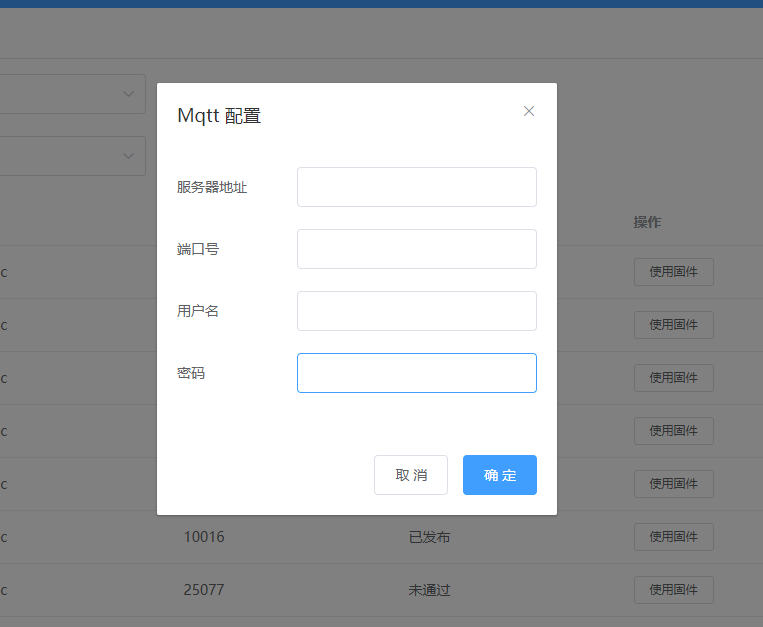
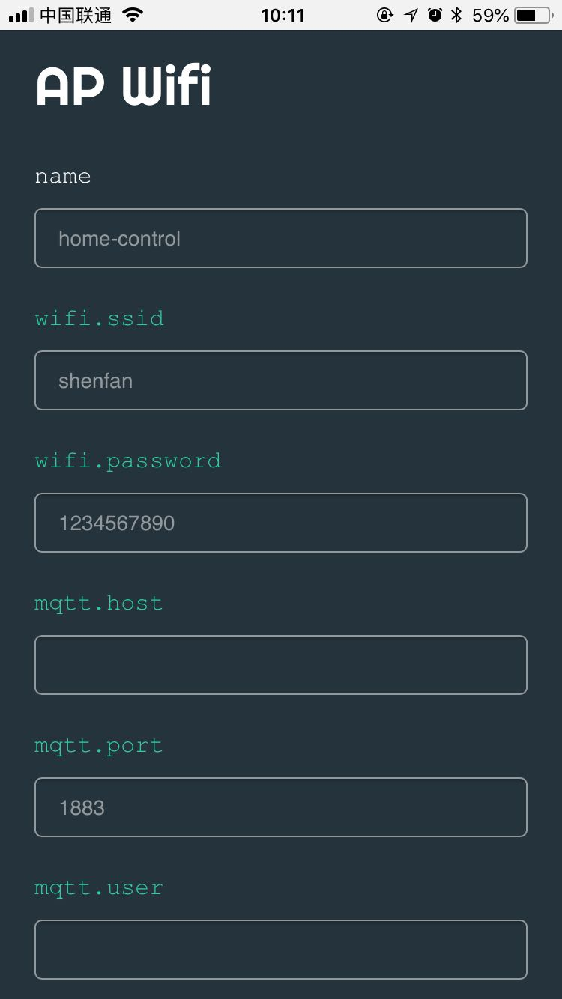
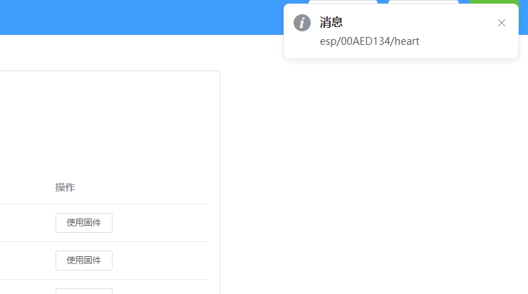
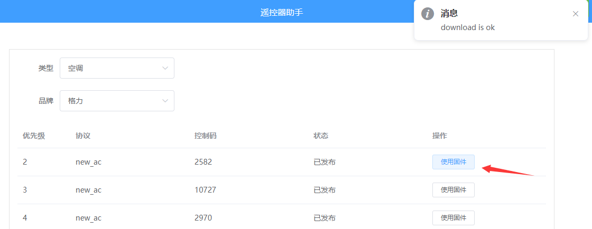

MqttIrext
=====

---
## 什么是MqttIrext?
MqttIrext [Irext](https://github.com/irext/irext-core)的一个衍生项目。
MqttIrext的作用是帮助你只需要一个ESP8266系列的模块和一个红外二级管就可以控制家里红外设备。
它的优势在于：
  > * 成本低廉只需要一个ESP8266模块或开发板如NodeMcu)和一个红外二级管
  > * 不需要人为学习红外码快速匹配到电器
  > * 有mqtt接口可以方便接入homeassistant

## 开发状态

MqttIrext 仍然处于前期开发阶段，未经充分测试与验证，不推荐用于生产环境。

**目前的交互协议可能随时改变，不保证向后兼容，升级新版本时需要注意公告说明同时升级服务端和客户端。**

## 说明
现已完成，当前版本只支持空调

## 使用方式
* 首先你需要刷好固件
* 打开 http://esp.shanming.top/#/, 配置mqtt信息,完成会提示是否连接

* 开启esp设备，查找`AP_HOME_NODE`或`Bleeper`热点，手机或电脑都可以连接，访问地址`192.168.4.1` 配置如下信息：

* 网页端会接收到这样一个消息

* 配置topic和针脚，默认是14也就是d5,8266型号就是`00AED134`
* 选择好空调固件，点击`使用固件`,会看到右上角有`download is ok`消息，证明固件下载完成

* 点击测试，会发送改变温度，从 `18度到30,制冷`,或在HomeAssistant中测试

## 发射管连接图


也可以尝试不用三级管，直接连接。红外二级管长引脚接gpio，短脚接地。

## HomeAssistant配置文件
记得修改mqtt型号
```yaml
climate:
  - platform: mqtt
    name: study
    friendly_name: 客厅空调
    modes:
      - cool
      - heat
      - auto
      - fan
      - dry
      - off
    swing_modes:
      - on
      - off
    fan_modes:
      - high
      - medium
      - low
      - auto
    power_command_topic: "esp/00AECB90/mode/set"
    mode_command_topic: "esp/00AECB90/mode/set"
    temperature_command_topic: "esp/00AECB90/temperature/set"
    fan_mode_command_topic: "esp/00AECB90/fan/set"
    swing_mode_command_topic: "esp/00AECB90/swing/set"
    min_temp: 16
    max_temp: 30
```

## 特别感谢
* [Strawmanbobi](https://github.com/strawmanbobi) Irext开源库的作者，给予我技术和精神上的支持
* [Caffreyfans](https://github.com/Caffreyfans) IRmqtt 开源库作者，我这这个基础上做了一些修改

